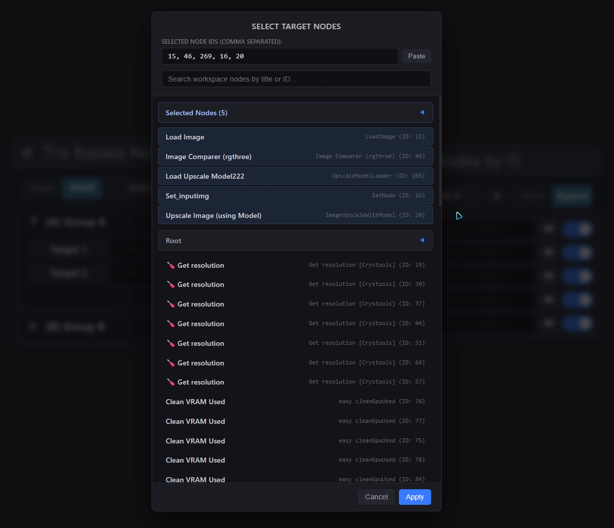
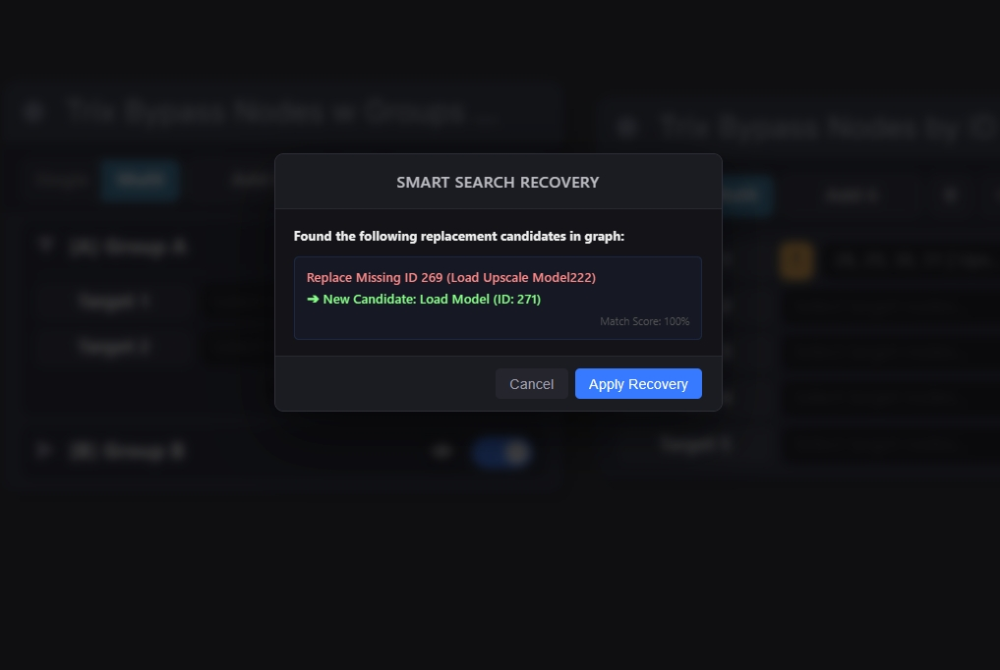
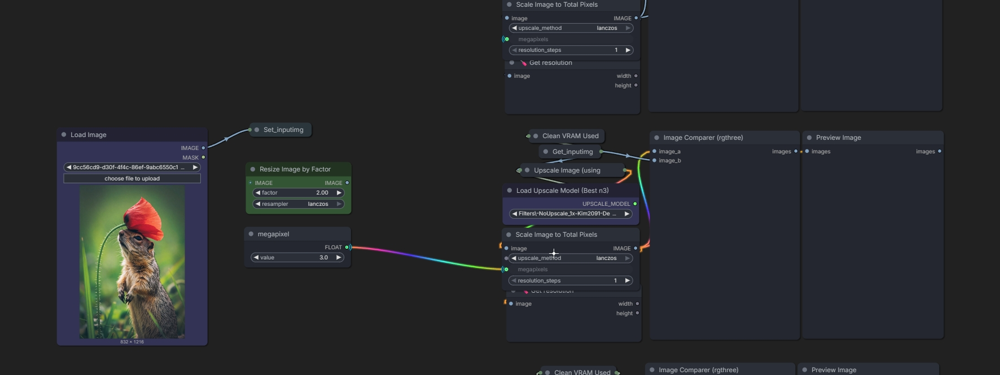
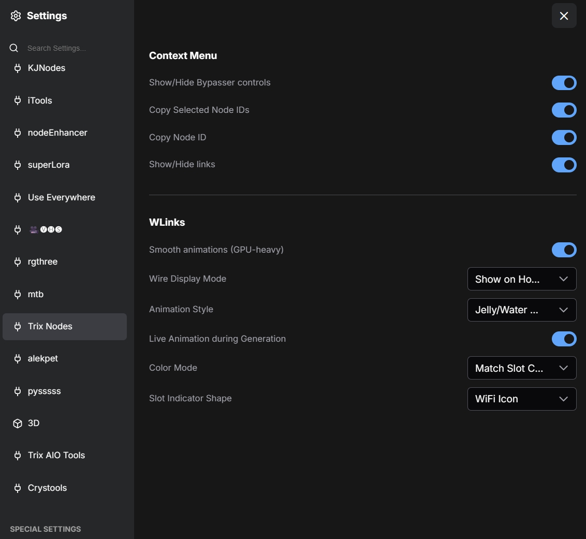

# ComfyUI-TrixNodes

[](README.md) [](README_RU.md)

Элегантный, премиальный и высокопроизводительный набор нод для управления рабочими процессами в [ComfyUI](https://github.com/comfyanonymous/ComfyUI). Группируйте ноды, удаленно отключайте/включайте (bypass/mute) элементы, мгновенно перемещайтесь по холсту и избавьтесь от запутанных проводов с помощью плавных, GPU-оптимизированных анимаций.

---

## 📌 Содержание
1. [🌟 Ключевые возможности](#-ключевые-возможности)
2. [📦 Обзор нод](#-обзор-нод)
3. [🎥 Наглядные примеры применения](#-наглядные-примеры-применения)
4. [🔌 Скрытие связей и анимации (WLinks)](#-скрытие-связей-и-анимации-wlinks)
5. [⚙️ Глобальные настройки](#️-глобальные-настройки)
6. [⚖️ Преимущества и сравнение](#️-преимущества-и-сравнение)
7. [🛠️ Установка](#-установка)

---

## 🌟 Ключевые возможности

- **Удобный пульт управления**: Удаленно переключайте состояния bypass/mute для нод и групп.
- **Быстрый фокус камеры**: Нажмите кнопку глаза `👁` рядом с любой целью, чтобы мгновенно переместить камеру на неё.
- **Скрытие проводов (WLinks)**: Скрывайте соединительные линии в один клик. Провода красиво проявляются в виде светящихся частиц только при наведении или клике.
- **Переключатель производительности**: Выбирайте между экономичным режимом (15 FPS) и максимальной плавностью на частоте вашего монитора (60+ FPS).

---

## 📦 Обзор нод

### 1. Визуальное представление нод
Пакет включает две основные ноды управления: `Trix Bypass Nodes w Groups by ID` (с группировкой по категориям и сворачиваемыми списками) и `Trix Bypass Nodes by ID` (упрощенный линейный список).


### 2. Скрытие кнопок управления
Вы можете скрыть кнопки управления на карточке ноды с помощью переключателя настроек, чтобы сделать визуальный вид ноды проще и лаконичнее.


### 3. Подменю выбора целей
Двойной клик или нажатие кнопки **Add C** открывает всплывающее меню поиска, где можно быстро выбрать нужные ноды для добавления в список целей.


### 4. Настройка целей и ID
После добавления цели отображаются в списке подменю со своими названиями и присвоенными идентификаторами.



### 5. Умное восстановление связей
Если целевая нода была потеряна или удалена, рядом с ней появится иконка предупреждения (`⚠️`). Нажатие на неё открывает окно умного восстановления для быстрого ремонта связи.



---

## 🎥 Наглядные примеры применения

Ниже представлены интерактивные демонстрации работы нод и анимаций связей в реальных сценариях:

### Демонстрация удаленного управления и навигации:


https://github.com/user-attachments/assets/4f7bda73-11b7-4b22-b691-83880091b7df


### Демонстрация анимаций связей WLinks:


https://github.com/user-attachments/assets/199bd3e8-db94-4703-8434-e10c57ad4910


---

## 🔌 Скрытие связей и анимации (WLinks)

WLinks позволяет очистить холст от лишней паутины линий, отрисовывая скрытые связи динамически только при вашем взаимодействии с элементами.

### 1. Анимации невидимых связей
После скрытия проводов через контекстное меню `🌊 Trix Hide Links`, они отображаются в виде плавных светящихся потоков частиц при наведении или выделении ноды.


### 2. Анимация связей вблизи
Детальный вид светящихся частиц, кастомных форм индикаторов слотов и их цветов.



---

## ⚙️ Глобальные настройки

Вы можете изменить глобальные параметры через стандартные настройки ComfyUI во вкладке **`Trix Nodes`**. Здесь настраиваются формы индикаторов слотов, неоновые цвета проводов, стили анимации, режимы видимости, частота обновления кадров (FPS) и видимость опций правого клика.



---

## ⚖️ Преимущества и сравнение

- **Чистота холста**: Заменяет классическое нагромождение проводов ComfyUI на интерактивные, проявляющиеся по запросу связи.
- **Удобная навигация**: Перемещение камеры к нужной ноде по кнопке глаза значительно быстрее, чем ручной поиск по огромным схемам.
- **Гибкое переключение**: Управляйте отдельными нодами или целыми группами из одного пульта, расположенного в любом удобном месте.

---

## 🛠️ Установка

1. Откройте терминал в папке кастомных нод ComfyUI:
   ```bash
   cd ComfyUI/custom_nodes/
   ```
2. Склонируйте этот репозиторий:
   ```bash
   git clone https://github.com/pixaroma/ComfyUI-TrixNodes.git
   ```
3. Перезапустите ComfyUI и обновите вкладку в браузере.
