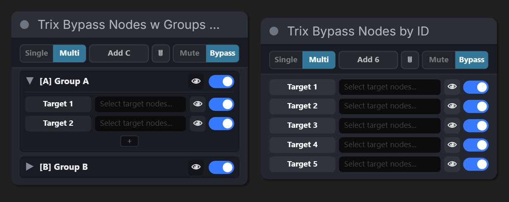
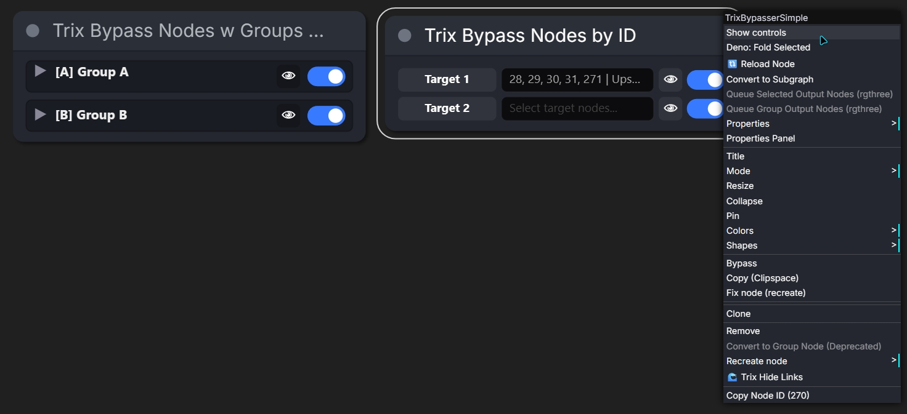
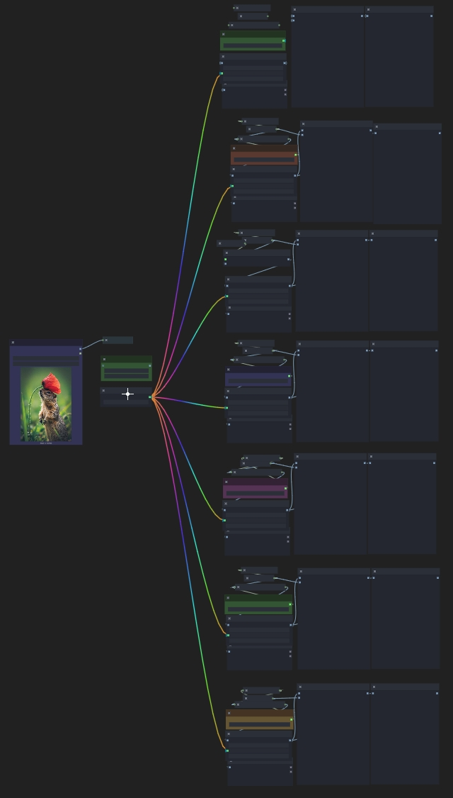
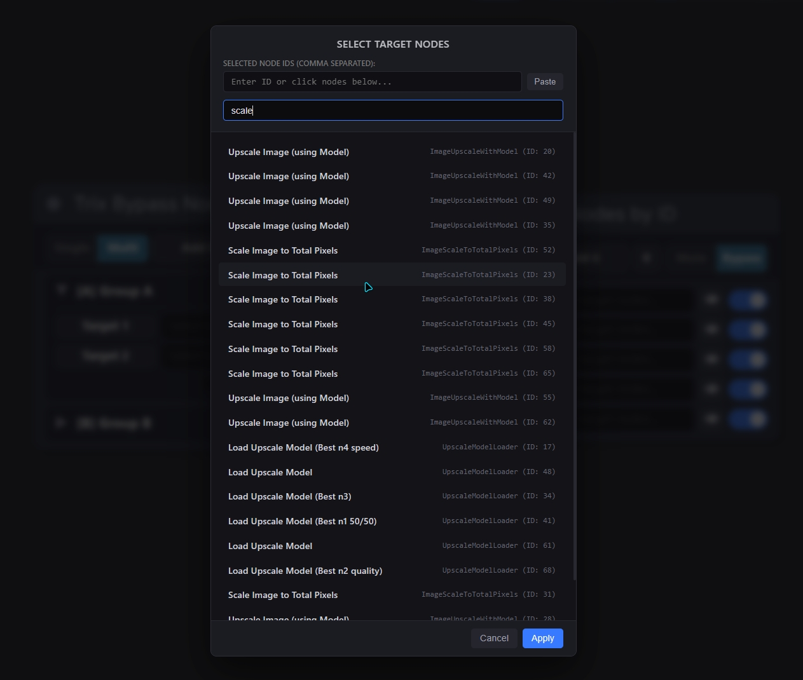

# ComfyUI-TrixNodes

[](README.md) [](README_RU.md)

Элегантный, премиальный и высокопроизводительный набор нод управления рабочими процессами для [ComfyUI](https://github.com/comfyanonymous/ComfyUI). Организуйте сложные схемы, удаленно отключайте (bypass/mute) ноды и целые группы, мгновенно перемещайтесь по холсту и избавьтесь от запутанных проводов («спагетти») с помощью красивых анимаций соединений, оптимизированных для GPU.


---

## 📌 Содержание
1. [🌟 Ключевые возможности](#-ключевые-возможности)
2. [📦 Входящие в комплект ноды](#-входящие-в-комплект-ноды)
   - [🎛️ Trix Bypass Nodes w Groups by ID](#️-trix-bypass-nodes-w-groups-by-id)
   - [🎚️ Trix Bypass Nodes by ID](#️-trix-bypass-nodes-by-id)
3. [🔌 Визуальное управление связями (WLinks)](#-визуальное-управление-связями-wlinks)
4. [⚖️ Сравнение со стандартными нодами](#️-сравнение-со-стандартными-нодами)
5. [⚙️ Глобальные настройки](#️-глобальные-настройки)
6. [🛠️ Установка](#️-установка)

---

## 🌟 Ключевые возможности

- **Единая панель управления**: Удаленно управляйте множеством нод и настраиваемых групп из одного удобного интерфейса.
- **Мгновенная навигация**: Нажмите на иконку глаза `👁` рядом с любой нодой или группой, чтобы мгновенно центрировать камеру холста на ней.
- **Скрытие связей (WLinks)**: Скрывайте выбранные линии связей для устранения визуального хаоса («спагетти»), сохраняя динамические интерактивные направляющие при наведении или клике.
- **Премиальный двуязычный интерфейс**: Красивые темные карточки с переключателями, не требующие сложной настройки, вкладки режимов и встроенные функции удаления.
- **Кастомизация анимаций проводов**: Несколько визуальных стилей анимаций (пульсация, плазма, волны) с поддержкой энергосберегающего режима (15 FPS) или максимальной плавности (60+ FPS / частота обновления вашего монитора).

---

## 📦 Входящие в комплект ноды

### 🎛️ Trix Bypass Nodes w Groups by ID

Позволяет группировать целевые ноды по именам групп (например, `[A] Group`, `[B] Group B`). Вы можете отключать/включать как всю группу целиком одной кнопкой, так и точечно управлять отдельными нодами внутри неё.



#### Функции ноды:
* **Single / Multi Select**: Быстрое переключение между выбором только одной активной группы (с автоматическим мьютом остальных) или независимым выбором нескольких групп.
- **Динамическое добавление/удаление целей**: Просто введите ID нод или добавьте их через выделение. Используйте режим удаления (кнопка `✕`), чтобы быстро очистить список целей.
- **Сворачивание групп**: Сворачивайте списки групп, чтобы карточка ноды оставалась компактной.

---

### 🎚️ Trix Bypass Nodes by ID

Упрощенная линейная нода управления, которая отображает плоский список целевых нод без разделения на группы. Отлично подходит для быстрого контроля ключевых генераторов, лоадеров или сейверов в вашем рабочем процессе.



#### Демонстрация работы:
Видеоролик ниже показывает процесс удаленного переключения нод, использование мульти-выбора и мгновенный фокус камеры по кнопке-глазику:

<video src="assets/example_bypass.mp4" controls width="100%"></video>

---

## 🔌 Визуальное управление связями (WLinks)

Встроенное расширение WLinks помогает поддерживать чистоту вашего холста. Вы можете выборочно скрывать линии связей для определенных нод, возвращая их видимость в виде красивых светящихся анимаций только в нужные моменты.

| Меню скрытия связей | Светящаяся анимация проводов |
| :---: | :---: |
|  |  |

#### Особенности:
* **Скрытие через контекстное меню**: Кликните правой кнопкой мыши по любой ноде холста и выберите `🌊 Trix Hide Links`, чтобы скрыть все её входные/выходные связи.
- **Динамический показ**: Наведите курсор на ноду или кликните по ней, чтобы временно увидеть скрытые связи.
- **Кастомизация слотов**: Настраивайте форму (Dashed Circle, Circle, Triangle, WiFi Icon) и цвет индикаторов слотов.

#### Формы индикаторов слотов:


#### Демонстрация работы WLinks:
Посмотрите, как выглядят стили анимаций связей и динамический показ наведения в действии:

<video src="assets/example_w_links.mp4" controls width="100%"></video>

---

## ⚖️ Сравнение со стандартными нодами

| Возможность | Стандартные решения ComfyUI | Набор TrixNodes |
| :--- | :---: | :---: |
| **Панель управления** | Разбросанные переключатели, громоздкий вид | Единый стильный пульт в темных тонах |
| **Управление целями** | Статичное, сложно менять на лету | Быстрое добавление и удаление прямо в ноде |
| **Фокусировка на целях** | Ручной поиск и прокрутка по всему холсту | Мгновенный перенос камеры по кнопке `👁` |
| **Управление связями** | Только глобальное скрытие (Все или Ничего) | Выборочное скрытие конкретных проводов (WLinks) |
| **Интерактивные связи** | Статичные, не реагирующие на мышь линии | Динамическая анимация при наведении или клике |
| **Оптимизация GPU** | Отсутствует | Двухрежимная частота перерисовки (15 / 60+ Гц) |

---

## ⚙️ Глобальные настройки

Вы можете изменить глобальные параметры через стандартные настройки ComfyUI во вкладке **`Trix Nodes`**:



- **Slot Indicator Shape**: Форма индикатора слота (`Dashed Circle`, `Circle`, `Triangle` или `WiFi Icon`).
- **Color Mode**: Настройка цвета проводов (`Match Slot Color` под цвет типа слота или неоновые пресеты).
- **Animation Style**: Стиль анимации связей (`Pulsation (Pulse)`, `Color Flow`, `Jelly/Water Wave Warping`, `Neon Plasma Flow`, `Sparkling Electricity`, `Floating Particles` или `Static`).
- **Wire Display Mode**: Когда показывать скрытые провода (`Hide Always`, `Show on Click / Selection` или `Show on Hover`).
- **Smooth animations (GPU-heavy)**:
  - **OFF (Выключено)**: Ограничивает анимацию холста в 15 FPS для максимальной экономии ресурсов GPU/CPU.
  - **ON (Включено)**: Отрисовывает анимации на частоте 60 FPS или герцовке вашего монитора для абсолютной плавности.
- **Опции контекстного меню**: Включение и отключение кастомных пунктов при правом клике (`Show/Hide Bypasser controls`, `Copy Node ID`, `Copy Selected Node IDs` и `Show/Hide links`).

---

## 🛠️ Установка

1. Перейдите в папку кастомных нод ComfyUI:
   ```bash
   cd ComfyUI/custom_nodes/
   ```
2. Склонируйте репозиторий:
   ```bash
   git clone https://github.com/pixaroma/ComfyUI-TrixNodes.git TrixNodes
   ```
3. Перезапустите ComfyUI и обновите вкладку в браузере.
